# API-TEST-RESULTS

## Endpoint
1. POST/items 
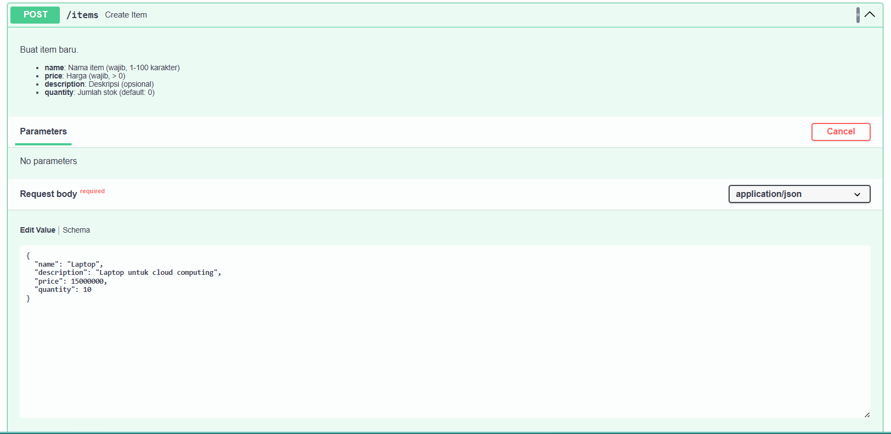 

2. GET_health
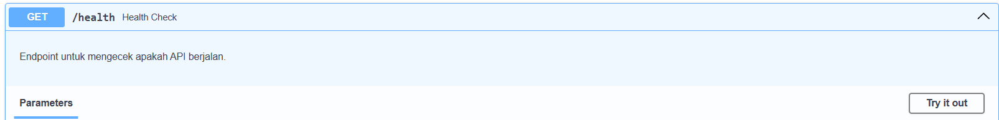

3. GET_items
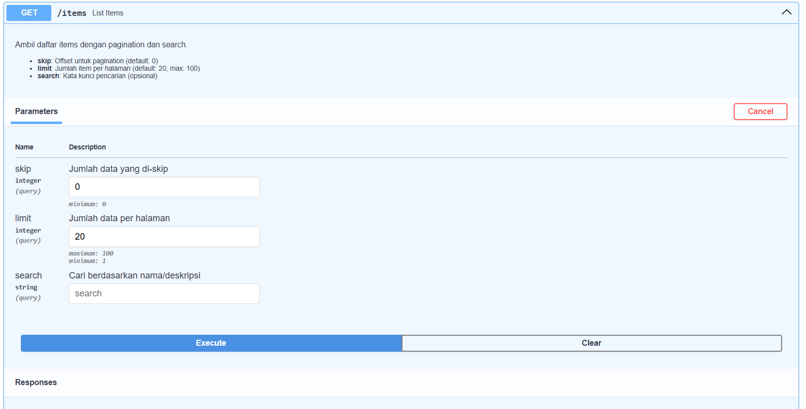

4. GET_items_stats
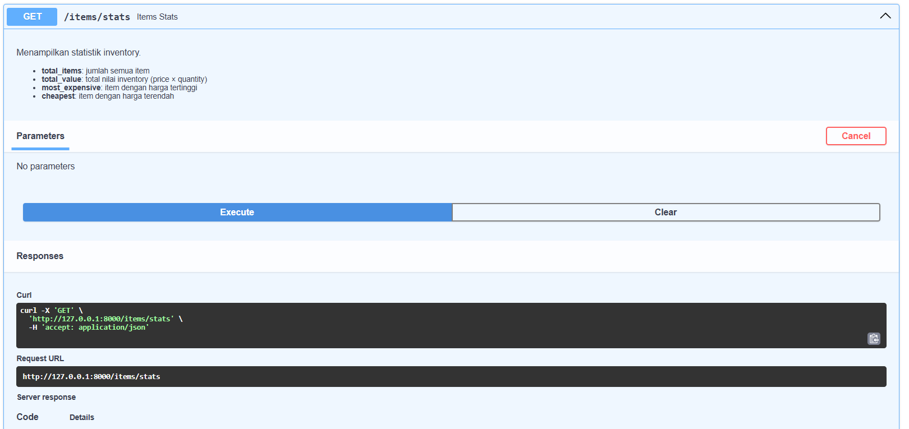

5. GET_items_{item_id}
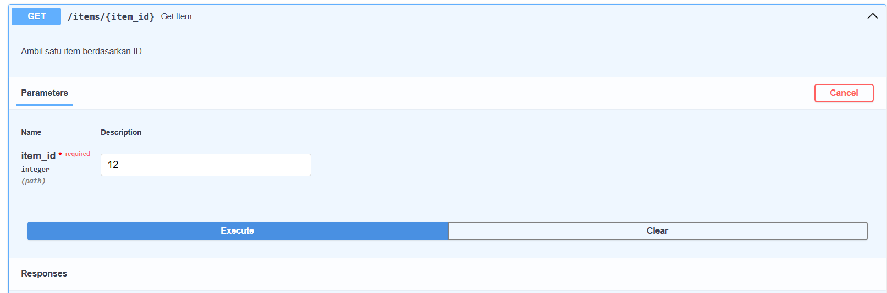

6. PUT_items_{item_id}
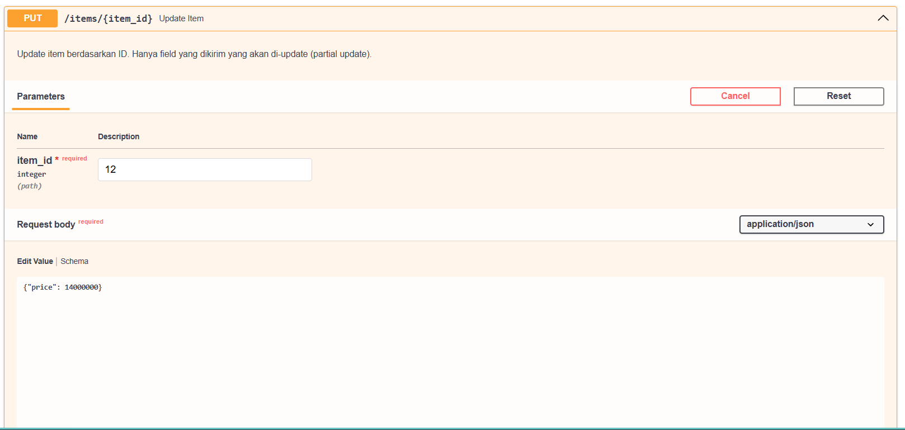

7. DELETE_item_{item_id}
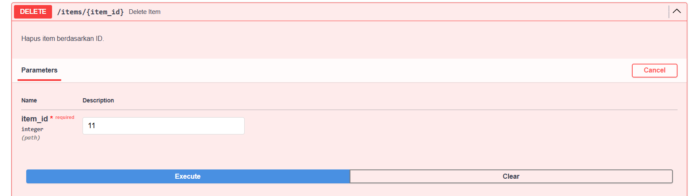

## Hasil

1. POST/items 
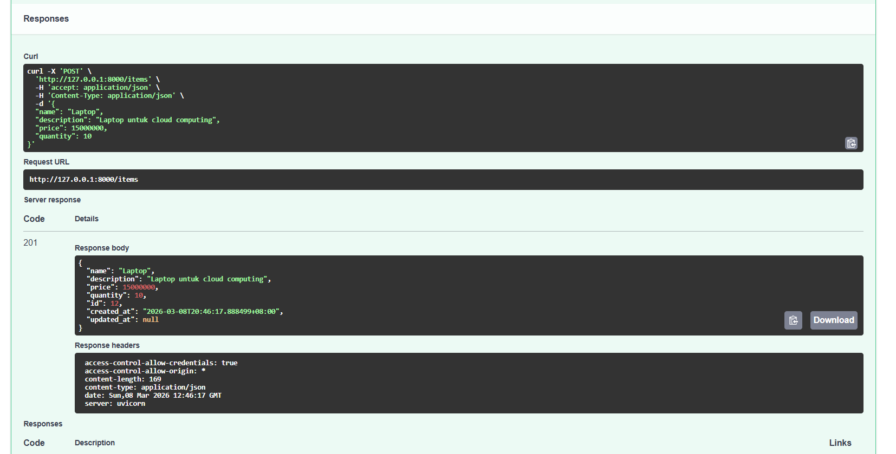 

2. GET_health
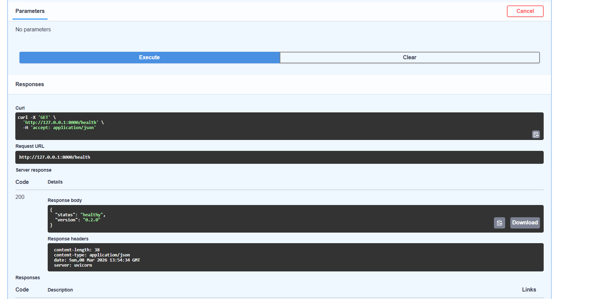

3. GET_items
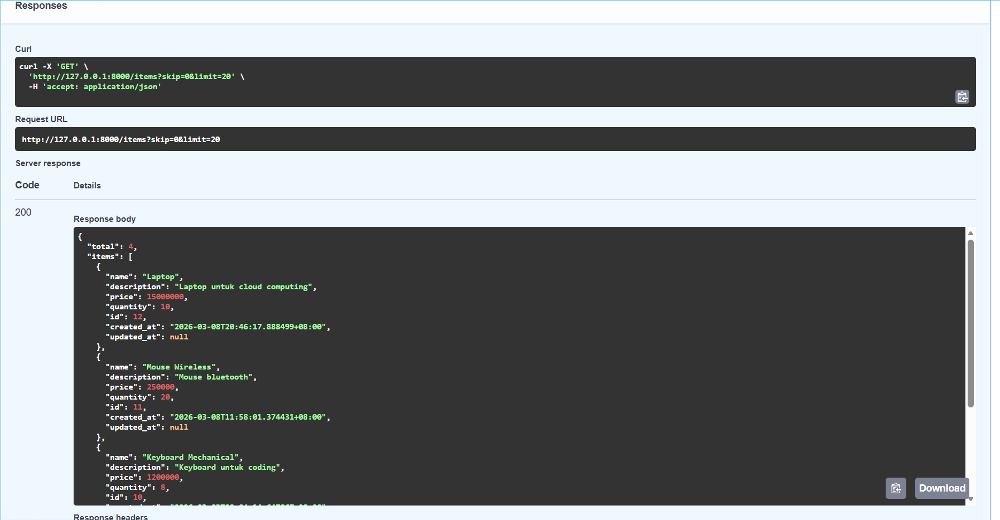

4. GET_items_stats
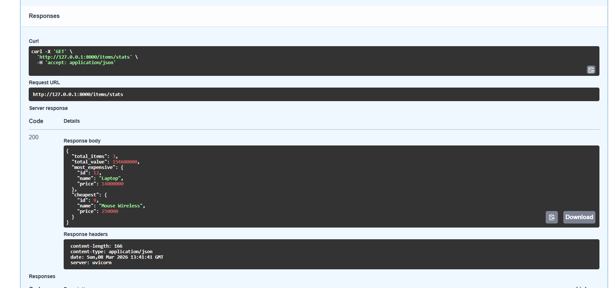

5. GET_items_{item_id}

6. PUT_items_{item_id}
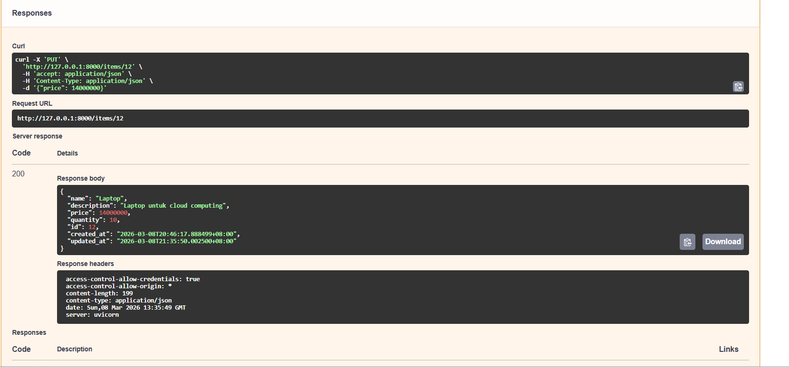

7. DELETE_item_{item_id}
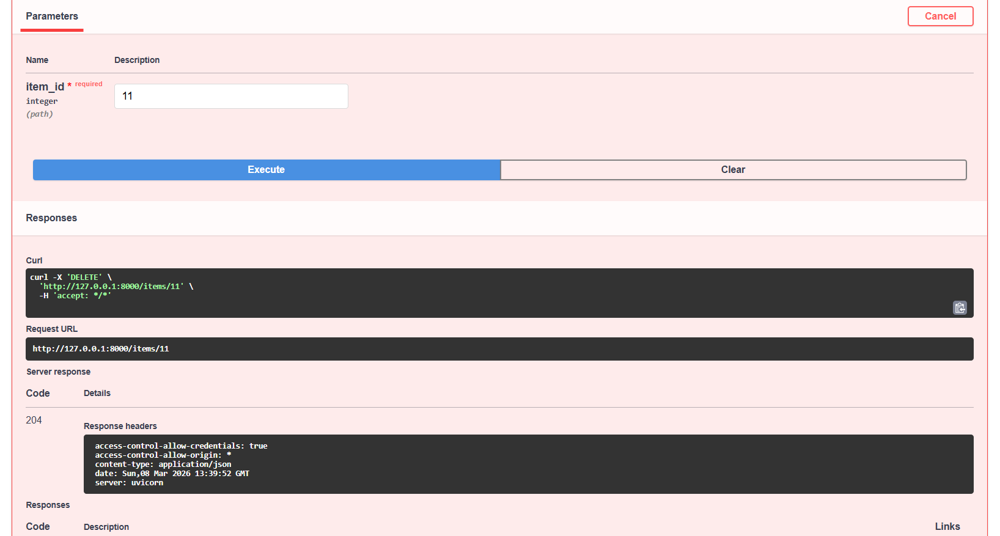

